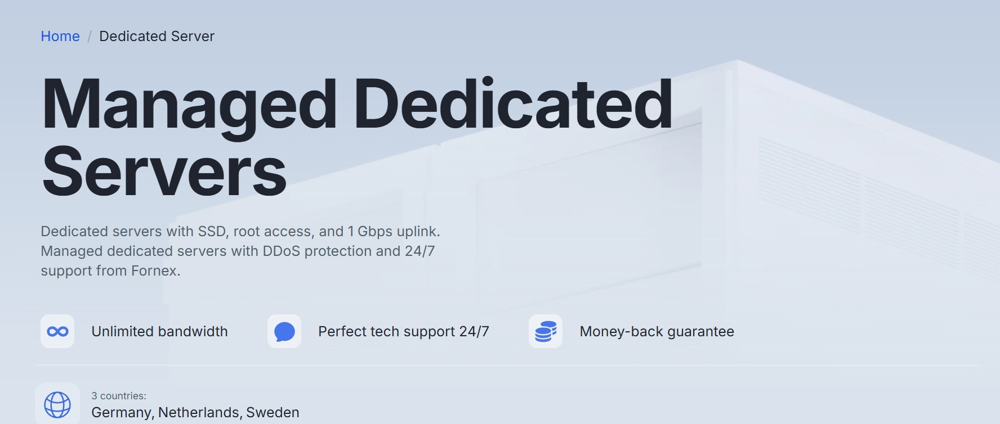

<b>🇷🇺 Русский</b> | <a href="https://odessacool1.github.io/vpn-global-blog/">🇺🇸 English</a>

# VPN для Binance: зачем он нужен криптотрейдерам

👉 **[Получить скидку 10%](https://fornex.com/code/v1j0nv/)**

## Почему пользователи Binance используют VPN

Binance — одна из крупнейших криптовалютных бирж в мире. Миллионы пользователей ежедневно заходят на платформу, чтобы:

- торговать криптовалютами
- анализировать рынок
- управлять портфелем
- использовать фьючерсы и деривативы
- работать с Web3 сервисами

Но при работе с криптовалютами возникает несколько важных факторов риска:

- интернет-провайдер может отслеживать активность
- публичные сети Wi-Fi небезопасны
- соединение может быть нестабильным
- некоторые сервисы могут работать медленно из-за маршрутизации сети

VPN помогает создать **защищённый канал соединения**, который повышает уровень приватности и стабильности подключения.

---

## Основные риски при работе без VPN

Многие криптопользователи не задумываются о сетевой безопасности, пока не сталкиваются с проблемами.

Без VPN возможны такие ситуации:

- перехват данных в публичной сети Wi-Fi
- отслеживание IP-адреса интернет-провайдером
- замедление соединения из-за маршрутизации
- нестабильная работа сервисов
- потенциальные сетевые атаки

Особенно это актуально для трейдеров, которые работают с крупными суммами или часто используют публичные сети.

VPN создаёт **зашифрованный туннель**, который помогает защитить интернет-соединение.

---

## Почему VPN может быть полезен именно для Binance

Некоторые пользователи используют VPN при работе с криптобиржами по нескольким причинам:

- защита соединения при входе в аккаунт
- безопасная работа из публичных сетей
- стабильное подключение к платформе
- дополнительный уровень приватности

Важно понимать:

VPN — это **инструмент сетевой безопасности**, а не способ обхода правил платформ.

Всегда важно соблюдать **условия использования Binance** и требования KYC.

---

## Почему для криптотрейдинга важна стабильность соединения

Для активных трейдеров важна не только безопасность, но и стабильность сети.

Проблемы соединения могут приводить к:

- задержке загрузки интерфейса
- проблемам с ордерами
- зависаниям графиков
- медленной загрузке данных

Использование стабильного VPN-провайдера может улучшить качество маршрутизации и снизить сетевые задержки.

---

## Почему Fornex подходит для крипто-пользователей

Fornex предлагает инфраструктуру, которая подходит для пользователей, работающих с криптовалютами.

Основные особенности:

- высокая скорость соединения
- современные протоколы
- безлимитный трафик
- серверы в Европе
- политика No-Logs
- надёжное шифрование

Поддерживаются популярные протоколы:

- WireGuard
- OpenVPN
- IKEv2
- XRay
- Outline

Это позволяет использовать VPN для безопасной работы в интернете и взаимодействия с криптосервисами.

---

## VPS для нод и крипто-инфраструктуры

Кроме VPN, Fornex предоставляет VPS-серверы, которые могут использоваться для:

- запуска блокчейн-нод
- тестнетов
- валидаторов
- крипто-ботов
- разработки Web3 приложений

Преимущества VPS:

- KVM виртуализация
- root-доступ
- NVMe диски
- высокая производительность
- стабильная инфраструктура

Это делает сервис удобным не только для трейдеров, но и для разработчиков.

---

## География серверов

Fornex использует инфраструктуру в нескольких странах:

- Германия
- Нидерланды
- Швеция
- Испания
- Швейцария
- США

Это позволяет выбрать оптимальную локацию для:

- стабильного соединения
- низкого пинга
- высокой скорости доступа

---

## Получить скидку 10%

Если вы хотите попробовать услуги Fornex, можно воспользоваться скидкой.

👉 **[Получить скидку 10%](https://fornex.com/code/v1j0nv/)**

Скидка распространяется на:

- VPN
- VPS
- выделенные серверы
- веб-хостинг
- защиту от DDoS

---

## Итог

VPN может быть полезным инструментом для пользователей криптовалют, которые хотят повысить уровень безопасности и стабильности соединения.

Он помогает:

- защитить соединение
- повысить приватность
- безопасно использовать публичные сети
- улучшить стабильность подключения

Для трейдеров, разработчиков и активных пользователей криптосервисов это может стать важной частью цифровой безопасности.
